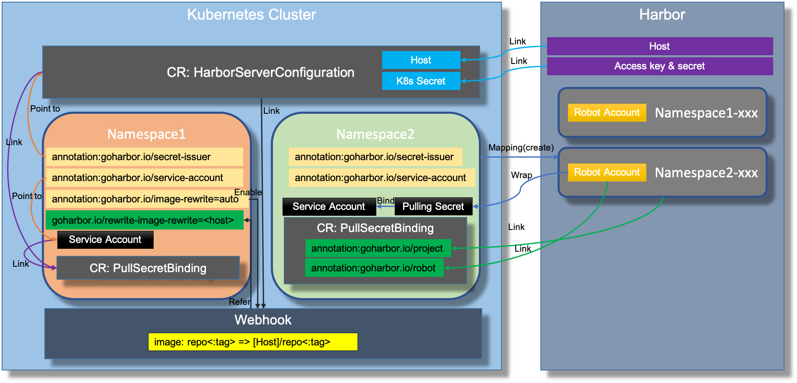

# harbor-automation-4k8s

harbor-automation-4k8 provides some features to do [Harbor](https://github.com/goharbor/harbor) Day2 operations in the Kubernetes
cluster and help to improve the overall Harbor user experiences, including:

- pulling secret auto injection
- image auto rewrite
- tbd

## Overall Design

The diagram below shows the overall design of this project:



* The Harbor server access info can be kept in a cluster scoped Kubernetes CR named `HarborServerConfiguration` by providing the access
host and access key and secret (key and secret should be wrapped into a kubernetes secret) for future referring.
* For enabling the pulling secret injection in a Kubernetes namespace:
  - add annotation `goharbor.io/secret-issuer:[harborserverconfiguration_cr_name]` to the namespace. `harborserverconfiguration_cr_name` 
  is the name of the CR `HarborServerConfiguration` that includes the Harbor server info.
  - add annotation `goharbor.io/service-account:[service_account_name]` to the namespace. `service_account_name` is the 
  name of the Kubernetes service account that you want to use to bind the image pulling secret later.
* When the namespace is creating, the operator will check the related annotations set above. If they're set, then:
  - make sure a corresponding project is existing (create if there is none) at the Harbor referred by 
  the `HarborServerConfiguration` referred in `goharbor.io/secret-issuer`.
  - make sure a robot account under the mapping project is existing (create if there is none).
  - a CR `PullSecretBinding` is created to keep the relationship between Kubernetes resources and Harbor resources.
  - the mapping project is recorded in annotation `annotation:goharbor.io/project` of the CR `PullSecretBinding`.
  - the linked robot account is recorded in annotation `annotation:goharbor.io/robot` of the CR `PullSecretBinding`.
  - make sure the lnked robot account is wrapped as a Kubernetes secret and bind with the service account that is 
  specified in the annotation `annotation:goharbor.io/service-account` of the namespace.
* If the annotation `annotation:goharbor.io/image-rewrite=auto` is set for the namespace, the mutating webhook is enabled.
  - any pods deployed to the namespace with image that does not have registry host (e.g.: `nginx:1.14.3`) will be rewrite 
  by adding harbor host and mapping project (e.g.: `goharbor.io/namespace1_xxx/nginx:1.14.3`) from the `HarborServerConfiguration` 
  referred in `goharbor.io/secret-issuer`.
  - the rewriting harbor host will be recorded in the annotation `goharbor.io/rewrite-image-rewrite` of the namespace.
* tbd

## Installation

For trying this project, you can follow the guideline shown below to quickly install the operator and webhook to your cluster:
(tools like `git`,`make`,`kustomize` and `kubectl` should be installed and available in the $PATH)

1. Clone the repository

```shell script
git clone git@github.com:szlabs/harbor-automation-4k8s.git
```

1. Build the image (no official image built so far)

```shell script
# set the image path
export IMG=goharbor.io/goharbor/harbor-automation-4k8s:dev

make docker-build && make docker-push
```

1. Deploy the operator to the Kubernetes cluster

```shell script
make deploy
```

1. Check the status of the operator

```
kubectl get all -n harbor-automation-4k8s-system
```

1. Uninstall the operator 

```shell script
kustomize build config/default | kubectl delete -f -
```
## Usages

### HarborServerConfiguration CR

Register your Harbor in a `HarborServerConfiguration` CR:

```yaml
apiVersion: v1
kind: Secret
metadata:
  name: mysecret
  namespace: kube-system
type: Opaque
data:
  accessKey: YWRtaW4=
  accessSecret: SGFyYm9yMTIzNDU=
---
apiVersion: goharbor.goharbor.io/v1alpha1
kind: HarborServerConfiguration
metadata:
  name: harborserverconfiguration-sample
spec:
  serverURL: 192.168.1.11
  accessCredential:
    namespace: kube-system
    accessSecretRef: mysecret
  version: 2.1.0
  inSecure: true
```

Create it:

```shell script
kubectl apply -f hsc.yaml
```

Use the following command to check the `HarborServerConfiguration` CR (short name: `hsc`):

```shell script
kubectl get hsc
```

### Pulling secret injection

Add related annotations to your namespace when enabling secret injection:

```yaml
apiVersion: v1
kind: Namespace
metadata:
  name: sz-namespace1
  annotations:
    goharbor.io/secret-issuer: harborserverconfiguration-sample
    goharbor.io/service-account: default
```

Creat it:

```shell script
kubectl apply -f namespace.yaml
```

After the automation is completed, a CR `PullSecretBinding` is created:

```shell script
kubectl get psb -n sz-namespace1

# output
#NAME             HARBOR SERVER                      SERVICE ACCOUNT   STATUS
#binding-txushc   harborserverconfiguration-sample   default           ready
```

Get the details of the psb/binding-xxx:

```shell script
k8s get psb/binding-txushc -n sz-namespace1 -o yaml
```

Output details:

```yaml
apiVersion: goharbor.goharbor.io/v1alpha1
kind: PullSecretBinding
metadata:
  annotations:
    goharbor.io/project: sz-namespace1-axtnd8
    goharbor.io/robot: "31"
    goharbor.io/robot-secret: regsecret-sab3pq
  creationTimestamp: "2020-12-02T15:21:48Z"
  finalizers:
  - psb.finalizers.resource.goharbor.io
  generation: 1
  name: binding-txushc
  namespace: sz-namespace1
  ownerReferences:
  - apiVersion: v1
    blockOwnerDeletion: true
    controller: true
    kind: Namespace
    name: sz-namespace1
    uid: 810efadd-b560-4791-8007-8decaf2fbb1c
  resourceVersion: "2500851"
  selfLink: /apis/goharbor.goharbor.io/v1alpha1/namespaces/sz-namespace1/pullsecretbindings/binding-txushc
  uid: f5b4f68a-4657-4f89-b231-0fc96c03ca00
spec:
  harborServerConfig: harborserverconfiguration-sample
  serviceAccount: default
status:
  conditions: []
  status: ready
```

The related auto-generated data is recorded in the related annotations:

```yaml
annotations:
    goharbor.io/project: sz-namespace1-axtnd8
    goharbor.io/robot: "31"
    goharbor.io/robot-secret: regsecret-sab3pq
```

### Image path rewrite

Add extra annotation to your namespace when enabling image rewrite:

```yaml
apiVersion: v1
kind: Namespace
metadata:
  name: sz-namespace1
  annotations:
    goharbor.io/secret-issuer: harborserverconfiguration-sample
    goharbor.io/service-account: default
    goharbor.io/image-rewrite: auto # enable mutating webhook to rewrite the image path
```

As mentioned before, the mutating webhook will rewrite all the images of the deploying pods which has no registry host 
prefix to the flowing pattern:

`image:tag => <hsc/hsc-name.[spec.serverURL]>/<psb/binding-xxx.[metadata.annotations[goharbor.io/project]]>/image:tag`